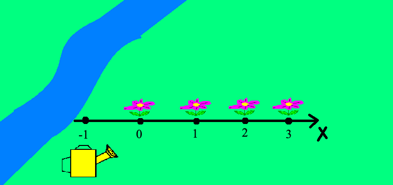

# Лабораторная работа №2
## Вариант 9

### Цели и задачи работы: изучение функций ввода-вывода данных, программирования вычисления значения выражения.
---
### Цель работы:
1. Реализовать линейный вычислительный процесс. Самостоятельно решить
задачу в соответствии с индивидуальным вариантом. Реализовать
представленные задачи на языках программирования C++, Python, Haskell (только одно задание), C#, Go, Ruby (только одно задание), Java.
JavaScript, PHP.
2. Реализовать линейный вычислительный процесс любого задания на языке
программирования Assembler.
3. Представленные задачи можно реализовать на каждом языке в одной
программе с последовательным выполнением.

<!-- ---
### Методика выполнения работы:
1. Определить типы используемых в программе данных.
2. Описать переменные.
3. Написать функции ввода-вывода.
4. Разработать алгоритм решения задачи по индивидуальному заданию.
5. Написать и отладить программу с вводом-выводом информации
6. Протестировать работу программы на различных исходных данных.
7. Изменить формат вывода, проверить работу программы при другом формате
вывода. -->
---
## Заданиe 1:   

Даны два неотрицательных числа a и b. Найти их среднее геометрическое, то есть квадратный корень из их произведения.

### Логика решения:
    result = sqrt(pow(a, 2) + pow(b,2))
***
## Заданиe 2:

У Вас на даче растут цветы, которым требуется постоянный полив. Цветы расположены в ряд и нумеруются от 0 до n-1 слева направо. Рядом течет река, в которой вы можете наполнить свою лейку при x = -1. Примечание: каждый цветок нуждается в поливе определенным количество воды. Алгоритм полива цветов:\
• Направление: слева направо.\
• Если после полива i-ого цветка не хватает полива для (i+1) цветка, то
нужно вернуться и набрать полную лейку.\
• Режим экономии: лейки можно наполнять в реке только тогда, когда это
требуется.\
Для решения задачи необходимо предусмотреть вариант нахождения рядом с рекой
в позиции -1. Для перемещения можно шагать по горизонтальной оси на 1.\
Необходимо определить число шагов для полива всех цветов для заданного
количества и потребности каждого цветка.

 Пример 1:
>Input: 3\
2, 2, 3, 3, 3\
5\
>Output: 14

Вводоные данные в этом примере не корректны поэтому
подгоним мысль автора под ответ и получим:

>Input: 4\
2, 2, 3, 3\
5\
>Output: 14

Пример 2:
>Input: 6\
1, 1, 1, 4, 2, 3\
4\
>Output: 30

Пример 3:
>Input: 7\
7 7 7 7 7 7 7\
8\
>Output: 49

На примере 1 разберём, что означают введённые данные\
Мы стартуем с -1 позиции, находящейся возле речки\
первое введённое число 4 означает кол-во цветков, которые нужно полить\
далее во второй строчке на вход подаётся обьём воды требуемый цветку для полива = 2, 2, 3, 3\
В третьей строчке на вход подаётся обьём лейки = 5

***

## Задание 3:

Посчитать количество чисел, являющихся полными квадратами (их корень
является целым числом). 
Пример: 
>Input: 4\
55 81 32 49 \
>Output: 2

